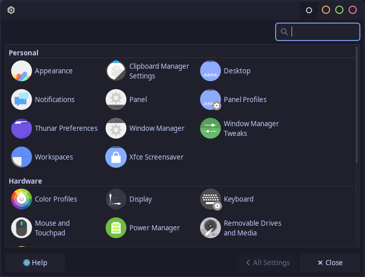
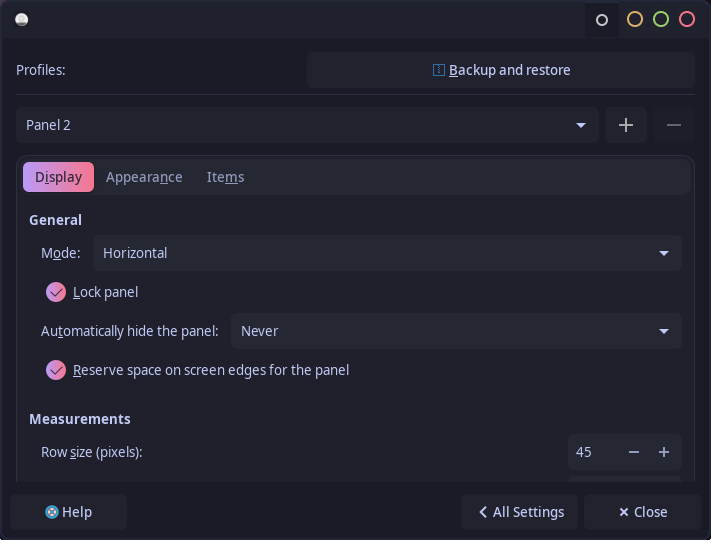
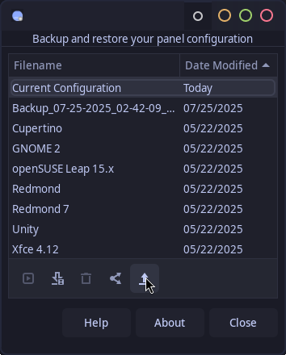

# Xfce settings Setup Guide

A step-by-step guide to configure the Xfce settings used in this setup.

> [!IMPORTANT]
> Please reboot after installation.

---

## Configuration Steps

### 0. Settings Manager

---

### 1. Apperance Settings

Go to Settings Manager → Apperance settings → and select the "Lavanda Dark Compact tokyo" theme .  

[Theme](assets/appearance.png)

---

### 2. Panel 

Follow the steps below to configure Blur My Shell:

- **Step 1:**  
  Go to Settings Manager → Panel → Back up and restore   
  Set the options as shown:  
  

- **Step 2:**  
  → Import → navigate to "~/.config/xfce4/panel/Miserable_xfce.tar.bz2" → apply.  
  Set the options as shown:  
  

**For reference the items arrangement in the panel bar and other settings..**
[Theme](assets/panel-1.png)
[Theme](assets/panel-2.png)
Here the application sidebar and system status buttons are a item named laucher import the config for each from  ~/.config/xfce4/panel/
[Theme](assets/panel-3.png)

### Window manager 

Go to Settings Manager → Window manager settings → and select the "cirkles" theme .  

[Wm](assets/window-manager.png)